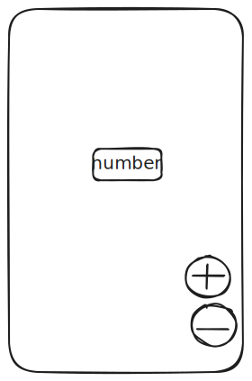

# flutter_counter

- web: https://bloclibrary.dev/tutorials/flutter-counter/
- source: https://github.com/felangel/bloc/tree/master/examples

## 业务



因此，操作有

```
event
  | increment
  | decrement
```

状态为

```
state = int
```

业务逻辑

```
bloc
  | increment -> state + 1
  | decrement -> state - 1
```

设计的action UI

```
"+" onclick -> increment
"-" onclick -> decrement
```

render UI

```
state -> Text(state)
```

## 测试

测试bloc

```
初始状态
  initState == 0

xxx
  _  --increment--> 1
  _  --increment--> 1 --increment--> 2
  42 --increment--> 43

xxx
  _  --decrement--> -1
  _  --decrement--> -1 --decrement--> -2
  43 --decrement--> 42
```

测试UI

```
当前状态
  mock
    bloc.state => 42
  pumpWidget
  find.text("42")

按下"+"
  mock
    state => 0
    increment => null
  pumpWidget
  tap("+")
  called counterCubit.increment() == 1

"-" 类似同上
```