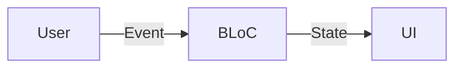
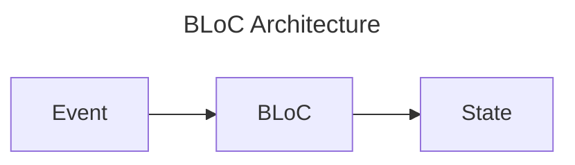

# flutter_counter

- web: https://bloclibrary.dev/tutorials/flutter-counter/
- source: https://github.com/felangel/bloc/tree/master/examples

## BLoC方式思考

软件角度，单向数据流:



Bloc 角度



图论的角度

- state: 节点
- event: 边

对于 Counter

1. 定义状态空间

    ```
    State = Int
    ```

2. 定义事件(Event)

    ```
    Event = Increment | Decrement
    ```

    即

    ```dart
    sealed class CounterEvent {
      const CounterEvent();
    }

    final class Increment extends CounterEvent {
      const Increment();
    }

    final class Decrement extends CounterEvent {
      const Decrement();
    }
    ```

3. 实现 BLoc

    ```
    Bloc
      | increment = state + 1
      | decrement = state - 1
    ```

    即

    ```dart
    class CounterBloc extends Bloc<CounterEvent, int> {
      CounterBloc() : super(0) {
        on<Increment>((event, emit) => emit(state + 1));
        on<Decrement>((event, emit) => emit(state - 1));
      }
    }
    ```

4. 实现 UI

    用户输入

    ```dart
    onPressed: () => context.read<CounterBloc>().add(Increment())
    onPressed: () => context.read<CounterBloc>().add(Decrement())
    ```

    状态显示

    ```dart
    BlocBuilder<CounterBloc, int>(
      builder: (context, state) => Text('$state')
    )
    ```

## 测试

### 测试 Bloc

也就是测试图的结构，可以说测试函数

```dart
blocTest<CounterBloc, int>(
  'emits [1] when state is 0',
  build: CounterBloc.new,
  act: (bloc) => bloc.add(Increment()),
  expect: () => const <int>[1],
);
```

### 测试 UI

#### 直接测试

```dart
testWidgets('renders CounterPage', (tester) async {
  await tester.pumpWidget(CounterApp());
  expect(find.byType(CounterPage), findsOneWidget);
});
```

#### 使用 Mock 的测试

```dart
// 创建 Mock 对象
class _MockCounterCubit extends MockCubit<int> implements CounterCubit {}

testWidgets('tapping increment button invokes increment', (tester) async {
  // 设置 Mock 对象
  final counterCubit = _MockCounterCubit();
  when(() => counterCubit.state).thenReturn(0);
  when(() => counterCubit.increment()).thenReturn(null);
  
  // 渲染使用 Mock 对象的 UI
  await tester.pumpWidget(
    MaterialApp(
      home: BlocProvider.value(
        value: counterCubit,
        child: CounterView(),
      ),
    ),
  );
  
  // 执行操作
  await tester.tap(find.byKey(incrementButtonKey));
  
  // 验证交互
  verify(() => counterCubit.increment()).called(1);
});
```


## 测试类型

测试策略，包含单元测试和集成测试两种测试类型：

### 单元测试

单元测试位于`test/`目录下，针对每个Widget组件和BLoC进行独立测试：

- **UI测试**：验证组件渲染、布局和交互行为
  - `test/app_test.dart`：测试CounterApp主应用组件
  - `test/counter/view/counter_page_test.dart`：测试CounterPage页面组件
  - `test/counter/view/counter_view_test.dart`：测试CounterView视图组件

- **BLoC测试**：验证业务逻辑和状态管理
  - `test/counter/cubit/counter_cubit_test.dart`：测试Counter Cubit的初始状态和状态转换

运行单元测试的方式：
```bash
# 运行所有单元测试
flutter test

# 运行特定测试文件
flutter test test/counter/cubit/counter_cubit_test.dart
```

也可以通过VS Code Flutter插件运行测试：
1. 打开测试文件
2. 点击测试方法旁边的"Run Test"图标
3. 或在VS Code底部栏选择"Run All Tests"

### 集成测试

集成测试针对实际设备或模拟器进行端到端测试，包含两种类型：

1. **Integration Test**：位于`integration_test/`目录下
   - 需要添加依赖：`flutter pub add --dev integration_test:{"sdk":"flutter"}`
   - 测试应用的完整流程，包括状态变化和UI响应

2. **Test Driver**：位于`test_driver/`目录下
   - 用于在各种平台上运行集成测试

运行集成测试命令：
```bash
# 在连接的设备上运行
flutter test integration_test/

# 在特定平台上运行（如Chrome）
flutter drive \
  --driver=test_driver/integration_test.dart \
  --target=integration_test/app_test.dart \
  -d chrome
```


